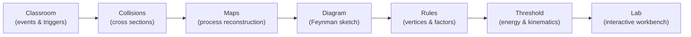
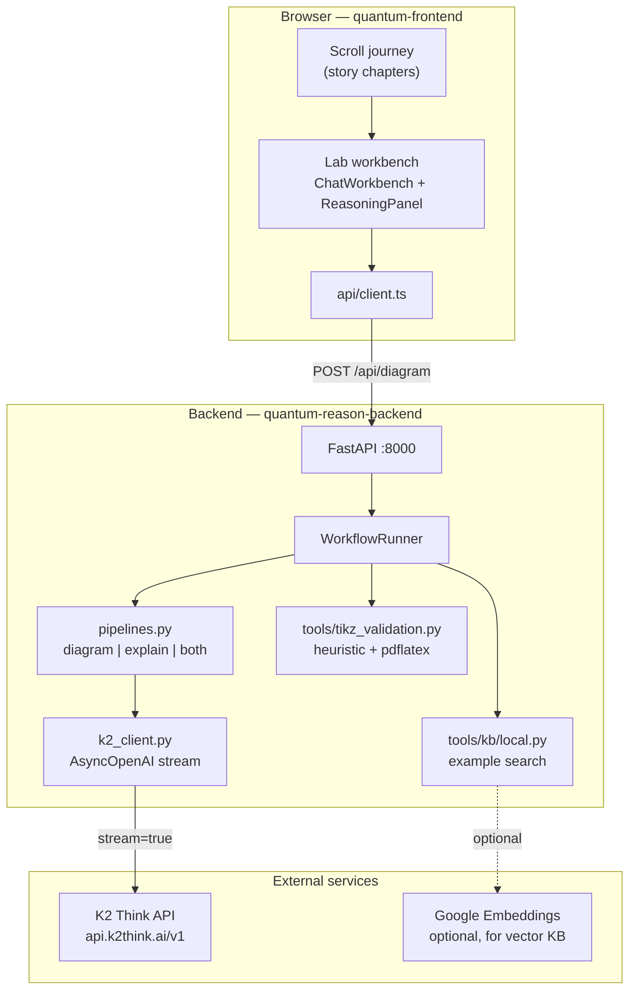
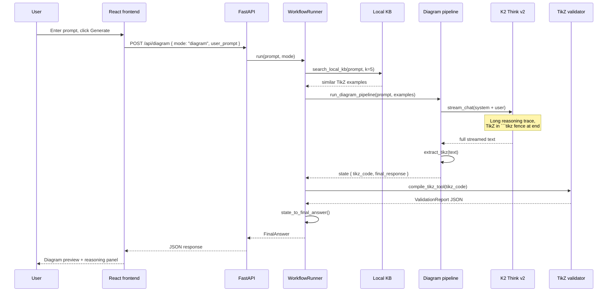
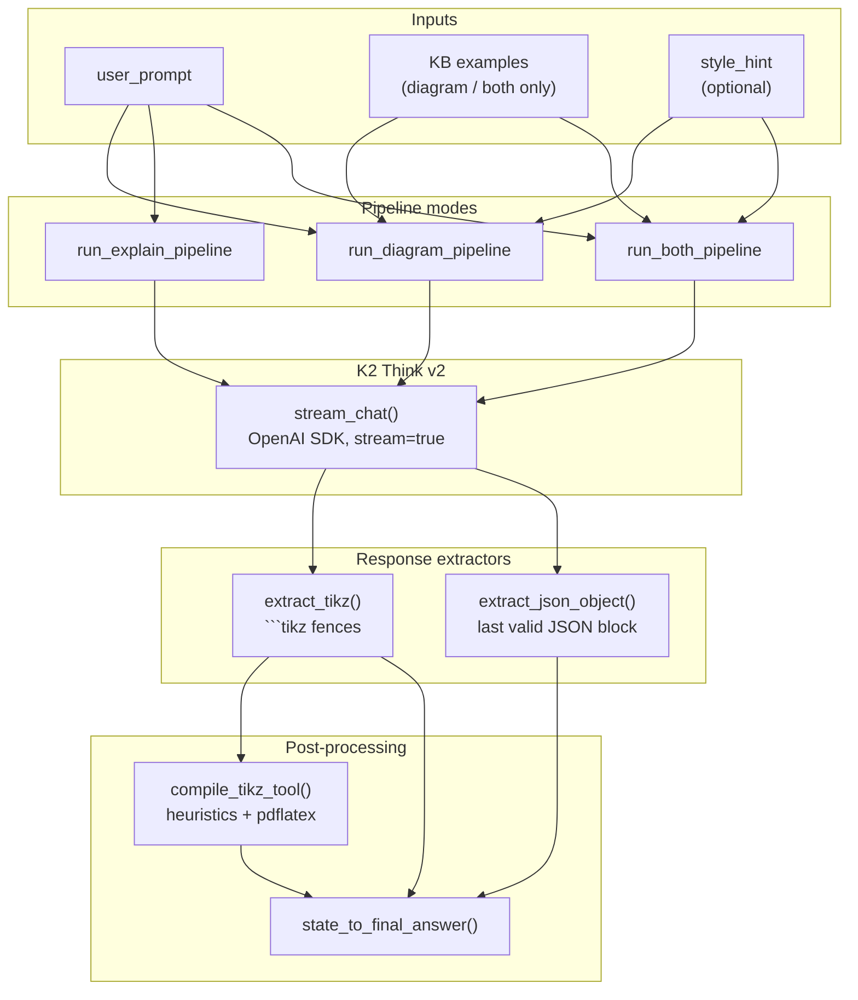
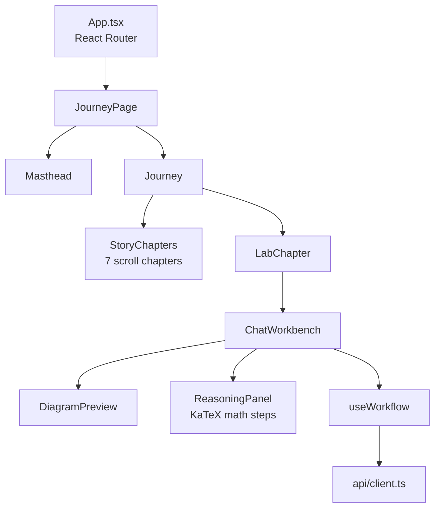

# Quantum Reason

**Quantum Reason** is a reasoning-first physics tutor built for the [Build with K2 Think V2](https://build.k2think.ai/) hackathon. It pairs a pen-and-paper storytelling frontend with a FastAPI backend powered by **K2 Think v2**, helping students go from intuitive collision pictures to Feynman diagrams and step-by-step mathematical explanations.

The product thesis: particle physics is easier to learn when **reasoning**, **diagrams**, and **equations** live in one continuous experience—not three disconnected tools.

---

## Table of contents

1. [From idea to implementation](#from-idea-to-implementation)
2. [User experience](#user-experience)
3. [System architecture](#system-architecture)
4. [Backend design](#backend-design)
5. [Frontend design](#frontend-design)
6. [Repository layout](#repository-layout)
7. [Getting started](#getting-started)
8. [API reference](#api-reference)
9. [Configuration](#configuration)
10. [Design decisions](#design-decisions)

---

## From idea to implementation

### The problem

Introductory particle physics often jumps between three modes of thinking:

- **Narrative** — what happened in the detector?
- **Diagrammatic** — which vertices and propagators describe the process?
- **Mathematical** — what is the amplitude, cross section, or propagator?

Students lose the thread when these modes are taught in isolation. Practicing researchers, meanwhile, constantly move between Feynman diagrams, Lagrangians, and experimental cuts.

### The idea

**Quantum Reason** treats reasoning as the spine of the product:

1. **Tell a story** — scroll through a ruled-notebook journey from classroom intuition to Feynman rules.
2. **Open the lab** — describe a physical process in plain language.
3. **Get structured output** — TikZ Feynman code, compile feedback, and JSON math explanations produced by K2 Think's chain-of-thought model.

The hackathon constraint shaped the stack: K2 Think v2 is exposed as an **OpenAI-compatible** streaming API, so the backend uses the official `openai` Python SDK rather than heavier agent frameworks.

### Implementation arc

| Phase | What we built |
|-------|----------------|
| **Prototype** | Multi-agent Google ADK pipeline (planner → KB → physics validator → diagram generator → TikZ validator) |
| **K2 integration** | Routed all LLM calls through LiteLLM to `https://api.k2think.ai/v1` |
| **Compatibility fixes** | Discovered K2 IFM keys require `stream=true`; tool/function calling and multi-turn ADK payloads fail on this endpoint |
| **Simplification** | Replaced ADK with plain async Python pipelines + OpenAI SDK |
| **Frontend connect** | React lab workbench with Diagram / Explain / Both modes, KaTeX reasoning panel, mock fallback |
| **Cleanup** | Removed legacy ADK code, unused MCP/physics stacks, and superseded prototype folders |

The current system is intentionally **small and reliable**: three pipeline modes, one model, predictable JSON/TikZ extraction.

---

## User experience

### Story journey (scroll)

The frontend is a single-page scroll experience styled like ruled notebook paper. Seven chapters walk the reader from detector events to the lab workbench:



Each chapter combines prose, margin equations (KaTeX), and inline SVG sketches. The lab chapter lazy-loads when the reader scrolls near it (or jumps via `/#lab`).

### Lab workbench (generate)

In the lab, the user picks a mode and submits a natural-language prompt:

| Mode | User gets |
|------|-----------|
| **Diagram** | TikZ-Feynman code + compile report |
| **Explain** | Structured math explanation (JSON → rendered steps + KaTeX) |
| **Both** | Diagram + explanation in one response |

Without a backend URL, the frontend falls back to a **mock pipeline** so the UI remains demoable offline.

---

## System architecture

### High-level overview



**How to read this diagram:** the browser never talks to K2 directly. All model calls go through the FastAPI backend, which orchestrates KB prefetch, LLM streaming, response parsing, and optional TikZ compilation checks.

### Request flow (diagram mode)



Explain mode skips KB prefetch and TikZ validation; it parses the **last valid JSON object** from K2's reasoning output into a `MathExplanation`. Both mode combines the two extractors on a single model call.

---

## Backend design

### Pipeline model

The backend no longer uses a multi-agent graph. Each mode is one async function in [`quantum_reason_adk/pipelines.py`](quantum-reason-backend/quantum_reason_adk/pipelines.py):



### Key modules

| Module | Role |
|--------|------|
| [`api/main.py`](quantum-reason-backend/api/main.py) | FastAPI app, CORS for `:5173`, health check |
| [`api/services/runner.py`](quantum-reason-backend/api/services/runner.py) | Orchestrates KB prefetch → pipeline → TikZ check |
| [`k2_client.py`](quantum-reason-backend/quantum_reason_adk/k2_client.py) | `AsyncOpenAI` client; always streams |
| [`response_extractors.py`](quantum-reason-backend/quantum_reason_adk/response_extractors.py) | Pulls TikZ/JSON from long K2 reasoning traces |
| [`prompts/`](quantum-reason-backend/quantum_reason_adk/prompts/) | System prompts for diagram + math explainer |
| [`tools/kb/local.py`](quantum-reason-backend/quantum_reason_adk/tools/kb/local.py) | Keyword or vector search over `feynman_kb.json` |
| [`tools/tikz_validation.py`](quantum-reason-backend/quantum_reason_adk/tools/tikz_validation.py) | Syntax heuristics + optional `pdflatex` compile |
| [`schemas.py`](quantum-reason-backend/quantum_reason_adk/schemas.py) | Pydantic models shared with the frontend types |

### Knowledge base

The local KB ([`data/feynman_kb.json`](quantum-reason-backend/quantum_reason_adk/data/feynman_kb.json)) stores curated TikZ-Feynman examples. Before diagram generation, the runner prefetches the top *k* matches and injects them into the user message as context.

- **With `GOOGLE_API_KEY`:** vector search via embeddings + Annoy index (if built)
- **Without:** keyword fallback still returns relevant examples

### Response schema

The API returns a `FinalAnswer` object:

```json
{
  "tikz": { "code": "\\feynmandiagram..." },
  "math_explanation": {
    "topic": "...",
    "domain": "qft",
    "key_equations": ["..."],
    "derivation_steps": [{ "title": "...", "latex": ["..."], "prose": "..." }],
    "physical_interpretation": "...",
    "reasoning_trace": "..."
  },
  "compile_report": { "ok": false, "errors": [], "warnings": ["pdflatex unavailable"] },
  "summary": "..."
}
```

---

## Frontend design

### Component architecture



### Visual system

- **Ruled paper** background with red margin line
- **Patrick Hand** + KaTeX for margin equations (`EquationNote`)
- **SVG sketches** per chapter (`StoryFigure`, `FeynmanSketch`)
- **Framer Motion** for subtle transitions (`prefers-reduced-motion` respected)

### Backend integration

| `VITE_API_BASE_URL` | Behavior |
|---------------------|----------|
| *(unset)* | Mock pipeline in `src/api/mock.ts` |
| `http://localhost:8000` | Live POST to `/api/diagram` with `mode` field |

Types in [`src/api/types.ts`](quantum-frontend/src/api/types.ts) mirror [`schemas.py`](quantum-reason-backend/quantum_reason_adk/schemas.py).

---

## Repository layout

```
quantum/
├── README.md                    ← this file
├── quantum-frontend/            ← React + Vite SPA
│   ├── src/
│   │   ├── api/                 client, types, mock fallback
│   │   ├── components/          journey, lab, sketch, story, layout
│   │   ├── hooks/               useWorkflow, useActiveChapter
│   │   └── journey/             chapter definitions
│   └── .env                     VITE_API_BASE_URL
│
└── quantum-reason-backend/      ← FastAPI + K2 pipelines
    ├── api/
    │   ├── main.py
    │   ├── routes/              diagram, explain
    │   └── services/            runner, parser
    ├── quantum_reason_adk/
    │   ├── k2_client.py
    │   ├── pipelines.py
    │   ├── prompts/
    │   ├── response_extractors.py
    │   ├── schemas.py
    │   ├── data/                feynman_kb.json
    │   └── tools/               kb, tikz_validation, latex_compiler
    ├── scripts/
    │   └── test_k2_client.py    connectivity smoke test
    └── .env                     K2_THINK_API_KEY
```

---

## Getting started

### Prerequisites

- **Node.js 18+** (frontend)
- **Python 3.11+** (backend)
- **K2 Think API key** from [build.k2think.ai](https://build.k2think.ai/)
- *(Optional)* `pdflatex` for real TikZ compilation checks
- *(Optional)* `GOOGLE_API_KEY` for vector KB search

### 1. Backend

```bash
cd quantum-reason-backend
python -m venv .venv

# Windows
.venv\Scripts\pip install -r requirements.txt

# macOS / Linux
# source .venv/bin/activate && pip install -r requirements.txt

cp .env.example .env   # add K2_THINK_API_KEY

python scripts/test_k2_client.py   # verify K2 connectivity
uvicorn api.main:app --reload --port 8000
```

### 2. Frontend

```bash
cd quantum-frontend
npm install

# create .env with:
# VITE_API_BASE_URL=http://localhost:8000

npm run dev
```

Open [http://localhost:5173](http://localhost:5173). Scroll to the lab or go directly to [http://localhost:5173/#lab](http://localhost:5173/#lab).

### 3. Smoke test

```bash
curl http://localhost:8000/api/health

curl -X POST http://localhost:8000/api/diagram \
  -H "Content-Type: application/json" \
  -d '{"user_prompt":"electron-positron annihilation to two photons","mode":"diagram"}'
```

Explain mode can take **60–120 seconds** — K2 Think emits a long internal reasoning trace before the final JSON.

---

## API reference

| Method | Path | Description |
|--------|------|-------------|
| `GET` | `/api/health` | Service status, model name, config warnings |
| `POST` | `/api/diagram` | Main endpoint — supports `mode`: `diagram`, `explain`, `both` |
| `POST` | `/api/explain` | Math explanation only (convenience wrapper) |

**Diagram request body:**

```json
{
  "user_prompt": "Draw muon decay",
  "mode": "diagram",
  "style_hint": "horizontal layout"
}
```

---

## Configuration

### Backend (`.env`)

| Variable | Required | Description |
|----------|----------|-------------|
| `K2_THINK_API_KEY` | Yes | K2 Think API key |
| `K2_API_BASE` | No | Default `https://api.k2think.ai/v1` |
| `K2_THINK_MODEL` | No | Default `MBZUAI-IFM/K2-Think-v2` |
| `GOOGLE_API_KEY` | No | Enables embedding-based KB search |

### Frontend (`.env`)

| Variable | Required | Description |
|----------|----------|-------------|
| `VITE_API_BASE_URL` | No | Backend URL; omit to use mock data |

---

## Design decisions

### Why OpenAI SDK instead of Google ADK?

K2's IFM endpoint is OpenAI-compatible but has strict constraints:

- **Streaming is mandatory** — non-streaming requests return `400`
- **Tool/function calling fails** — ADK's multi-agent handoffs break
- **Long reasoning output** — K2 Think emits chain-of-thought before the final TikZ or JSON

A thin `AsyncOpenAI` wrapper with plain Python pipelines proved more reliable than ADK + LiteLLM bridges.

### Why extract JSON/TikZ from the end of responses?

K2 Think v2 is a reasoning model. A typical explain response can exceed 100k characters of internal reasoning before the final JSON block. Extractors scan for the **last valid** fenced JSON or `\feynmandiagram` block rather than parsing the entire stream as structured output.

### Why a scroll story + lab?

The story chapters establish *why* Feynman diagrams matter before the user touches the generator. The lab then feels like the natural next step—opening your notebook to try a process yourself—rather than landing on a blank chat box.

### Known limitations

- **Latency:** K2 Think responses are slow (tens of seconds to ~2 minutes)
- **TikZ compile:** Requires local `pdflatex`; otherwise heuristic validation only
- **No live streaming to UI:** The frontend waits for the full JSON response (streaming is backend → K2 only)
- **Single-model pipeline:** No separate fast "instruct" model on all API keys

---

## Hackathon alignment

Built for **[Build with K2 Think V2](https://build.k2think.ai/)** — showcasing K2's reasoning trace in the math explainer's `reasoning_trace` field and the lab's reasoning panel, while generating publication-style TikZ-Feynman diagrams from natural language.

---

## Further reading

- Backend details: [`quantum-reason-backend/README.md`](quantum-reason-backend/README.md)
- Frontend details: [`quantum-frontend/README.md`](quantum-frontend/README.md)
